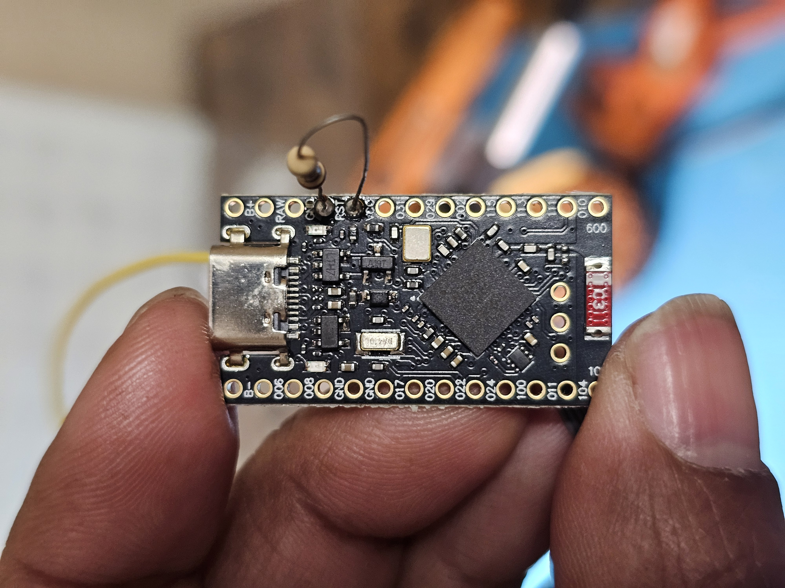
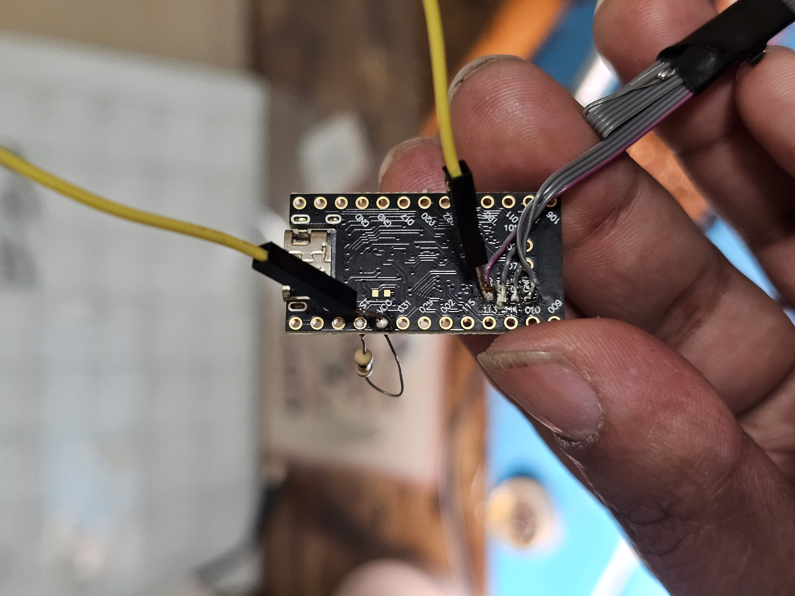

# Recover a Bricked nRF52840 Pro Micro / nice!nano (Clone)

If you are here, it likely means you have also **bricked your nRF52840 board** by:

- Flashing the wrong firmware  
- Flashing the wrong bootloader  
- Erasing UICR accidentally  
- Interrupting a bootloader update  

---

## Typical Symptoms

- Board powers from USB.
- The **3.3V rail reads ~3.3V**.
- The pad labeled **RST reads 0V**.
- The back-side pad labeled **VDD reads around ~1.8V**.
- USB no longer enumerates.
- Double-tap reset does nothing.

If this matches your board — this guide is for you.

You will need a **J-Link or ST-Link** SWD programmer to recover the device.

---

# Hardware Setup

## What is happening electrically?

After a bad flash, the regulator or power domain may be left in a semi-enabled state.  
The MCU becomes partially powered (~1.8V), which prevents the debug access port from powering up.

To recover, we force a stable 3.3V rail and access the chip via SWD.

---

## 1️⃣ Add a Low-Ohm Resistor

Solder a small resistor (1Ω–10Ω works fine) as shown below.

This helps stabilize the power path during recovery.



---

## 2️⃣ Inject Clean 3.3V to VDD

Connect a stable external **3.3V supply directly to the VDD pad** on the back of the board.

⚠️ Do NOT power through VBAT or other rails during recovery.



---

## 3️⃣ Connect SWD Programmer

Connect your J-Link or ST-Link to the 4 SWD pads:

- VDD (3.3V reference)
- GND
- SWDIO
- SWCLK


### Important Power Sequence

1. Connect the board to USB first  
2. Then connect the SWD programmer  

This ensures stable power before debug attachment.

---

# Software Recovery

This guide uses **nrfjprog** (Nordic Command Line Tools).

---

## 1️⃣ Verify Connection

```bash
nrfjprog --ids
````

If a device ID appears, SWD communication is working.

---

## 2️⃣ Full Recover (Erase Flash + UICR)

```bash
nrfjprog --recover --family NRF52
```

This command:

* Erases main flash
* Erases UICR
* Clears debug protection
* Restores full SWD access

---

## 3️⃣ Verify Erase (Optional)

```bash
nrfjprog --memrd 0x00000000 --n 32 --family NRF52
```

Expected output:

```
FFFFFFFF FFFFFFFF FFFFFFFF FFFFFFFF
```

---

## 4️⃣ Flash Bootloader

Example for nice!nano bootloader:

```bash
nrfjprog --program nice_nano_bootloader-0.10.0_s140_6.1.1.hex --verify --reset --family NRF52
```

Adjust filename depending on your board.

---

## 5️⃣ Power Cycle

Unplug USB.
Reconnect USB.

You should now see the UF2 bootloader drive enumerate.

---

# Notes

* The `.uf2` bootloader updater file does NOT work if the bootloader is erased.
* You must flash the `.hex` via SWD first.
* The ~1.8V VDD symptom is a power domain issue, not permanent damage.
* This recovery method works for:

  * nice!nano
  * nice!nano clones
  * nRF52840 Pro Micro
  * Most nRF52840 boards with similar regulator topology

---

# If Recover Fails

Try lowering SWD speed:

```bash
JLinkExe
device nRF52840_xxAA
if SWD
speed 4
connect
```

Then retry:

```bash
nrfjprog --recover --family NRF52
```

---

# Final Words

Your board is almost certainly **not permanently bricked**.

As long as SWD responds, it is recoverable.

Happy debugging 🚀

